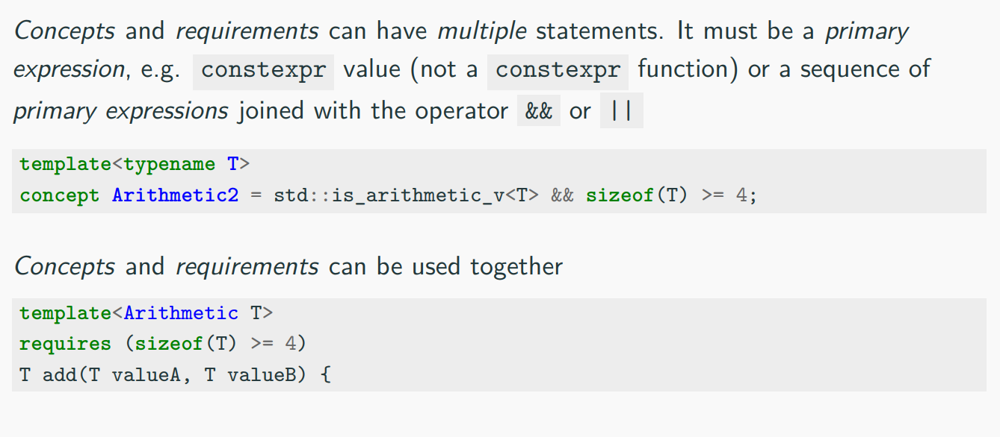
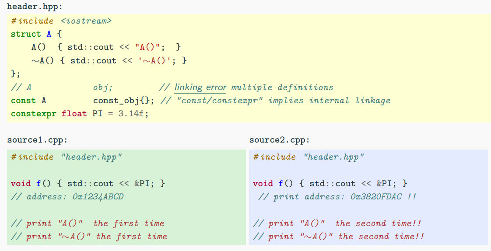
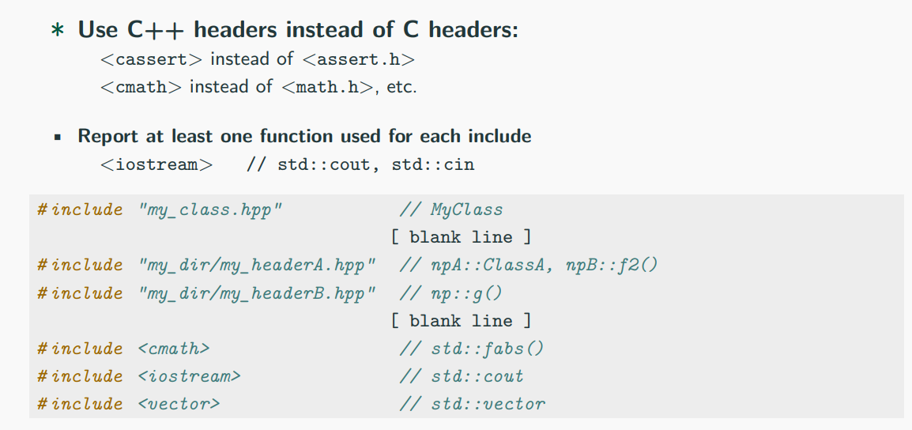
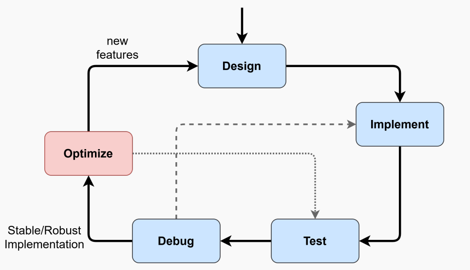

# 现代C++编程

## Introduction

### c/c++历史概览


### 应用领域

+ Operating systems: Linux, Windows, OS X, Android
+ Compilers: LLVM, Swift compiler
+ Artificial Inteligence: TensorFlow, Caffe
+ Image Editing: Adobe Premier, Photoshop
+ Web brower: Firefox, Chrome, etc. + WebAssembly
+ High Performance Computing
+ Embedded systems: IoT, netword devices, automotive
+ Database: MySQL, etc.
+ Video Games: Unreal Engine, Unity
+ Finance
+ ......

### C++ 哲学

c++主打高性能。“Do not sacrifice **performance** except as a last resort”。

+ 零开销原则
+ 静态类型
+ programing model
+ predictable runtime
+ low resources: low memory and enery consumption
+ portability

## 基础C++

### 基本类型

+ 算术类型 (char, short, int, float, double, etc.)
+ `void`类型, `sizeof(void)==1`在C中可编译，在C++中不能编译
+ `nullptr` ，表示空指针，用于替换`NULL`


### auto关键字

由编译器自动推导变量类型。


### 浮点类型（实数）

c++采用IEEE754标准。IEEE764（754-2019）


#### 巨量损失（Catastrophic Cancellation）

**Catastrophic cancellation** (or loss of significance) refers to loss of relevant information in a floating-point computation that cannot be revered 。

```c++
while (x > 0)
    x = x - y;
///
float: x = 10,000,000 y = 1  --> 10,000,000
float: x = 30,000,000 y = 1  --> 不会终止
```

+ 减小误差传播，多用乘法或除法，少用加法或减法

### 堆和栈

因为c++是手动管理内存分配，所以需要对程序的堆和栈有明确的认知。栈空间一般程序用来存储函数和局部变量的部分，堆空间即动态内存，需要手动分配和管理以及释放，避免内存泄漏。


+ 数据段（Data and BSS segment）远大于栈空间，但是也更慢。

|                     |               Stack               |                             Heap                             |
| :-----------------: | :-------------------------------: | :----------------------------------------------------------: |
| Memory Organization |         Contiguous(LIFO)          | Contiguous within an allocation, Fragmented between allocations(relies on virtual memory) |
|      Max size       | Small(8M on Linux, 1M on windows) |                     Whole system memory                      |
|      If exceed      |  Program crash at function entry  |                     Exception or nullptr                     |
|     Allocation      |           Compile-time            |                           Run-time                           |
|      Locality       |               High                |                             Low                              |
|     Thread View     |   Each thread has its own stack   |                     Shared among threads                     |

### 初始化

+ Uniform Intialization, `{}` , 这种初始化保证一定的安全性，因为不允许窄转换。

+ Designated Initializer List

  + ```c++
    struct A {
        int x, y, z;
    };
    A a2 {.x = 1, .y = 2, };  // z is default, 0
    ```

### 指针和引用

#### 指针以及其操作

> A **pointer** `T*` is a value referring to a location in memory.

+ 解引用，`(*ptr)`
  + 下标访问，`ptr[i]` 等同于 `*(ptr + i)`

+ 支持的运算符， `+, -, ++, --`，比较运算`==, !=, <=, >=, <, >`

#### 引用

> A variable **reference** `T&` is an **alias**, namely another name for an already existing variable.

+ 指针（作为一个变量）拥有自己的内存地址和大小，引用与原始变量共享相同的地址。
+ 编译器在内部将引用作为指针实现，但对待的方式不同。
+ 引用比指针更加安全。
  + 引用没用`NULL`.
  + 引用不能改变，一旦绑定到一个对象，那么就不能再绑定其他对象
  + 应用必须初始化

### 函数

#### 基础

目的：

+ 避免代码冗余
+ 可读
+ 有组织

参数传递：

|                | pass by value                                                | pass by pointer                                | pass by reference                                        |
| -------------- | ------------------------------------------------------------ | ---------------------------------------------- | -------------------------------------------------------- |
| 优势           | 实参形参互不影响                                             | 函数可以改变实参值，比传值快                   | 和指针优势一样，同时更可读，避免了指针的劣势。           |
| 劣势           | 性能有影响，因为是拷贝语义，形参是实参的一个副本。同时优势也可能是劣势 | 实参可能是null pointer，解引用没有直接访问快。 | -                                                        |
| 什么时候使用   | Built-in data type and small object。同时不需要对外部值做修改。 | Raw arrays(use const T* if read-only)          | All cases except raw pointers。（const T& if read-only） |
| 什么时候不使用 | large objects.                                               | All other cases                                | pass by value适用的时候                                  |

#### 签名与重载

函数签名包括参数数量，参数类型和参数顺序。（注意不包括返回类型）

函数重载表示相同的函数但是有不同的签名。

#### 函数对象与Lambda表达式

| Function Pointer (in C)                                      | Functor                                                      |
| ------------------------------------------------------------ | ------------------------------------------------------------ |
| 通过函数指针，函数作为参数，可以被间接调用。但是存在安全和性能上的问题，没有对参数类型的检查。 | 作为一种可以被调用的对象，也可以被当做参数传递。在安全性上有类型检查，能够包含模板。 |

```c++
#include <algorithm>

struct Descending { // -- function object
    bool operator()(int a, int b) {
        return a > b;
    }
};
int array[] = {7, 2, 5, 1};
std::sort(array, array+4, Descending{});
```

##### Lambda Expression

> A C++11 lambda expression is an _inline local-scope_ function object

`auto x = [capture clause] (parameters) {body}`

+ `[capture clause]` marks the declaration of the lambda and how the local scope arguments are captured(by value, by reference, etc.)
+ `parameters`与普通函数参数一样
+ `body`与普通函数体一样

The expression to the right of the `=` is **lambda expression**, and the runtime object `x`created by that expression is **closure**

+ 捕获列表和类

  ```c++
  class A {
    int data = 1;
    void foo() {
        int var = 2;
        auto labmda1 = [=]() {int var=3; return var;}; // return 3 (neast scope)
        auto labmda2 = [=]() {return var;}; // copy by value, return 2
        auto labmda3 = [this]() {return data;}; // copy by reference
        auto labmda4 = [*this]() {return data;}; // copy by value
    }
  };
  ```

  + `[this]`通过引用的方式捕获当前对象，c++17
  + `[x = x]`通过值的方式捕获当前对象的成员变量，c++14
  + `[&x = x]`通过引用的方式捕获当前成员变量，c++=14

  

### 预处理与宏

预处理过程在编译过程之前，主要处理带`#`的代码，如一些宏语句，宏展开，引入头文件内容等。

尽量少使用宏，因为不好调试，可读性差，已经没有namespace，scope。

一些常见的错误：

+ 不要在头文件和`include`语句之前定义宏
+ 在宏定义的时候要使用`()`对每个参数进行约束
+ ......

#### Useful Macro

+ `__LINE__` Integer value representing the current line in the source code file being compiled
+ `__FILE__` A string literal containing the presumed name of the source file being compiled
+ `__DATE__` A string literal in the form "MMM DDD YYY"  containing the date in which the compilation process began
+ `__TIME__` A string literal in the form "hh:mm:ss" containing the time at which the compilation process began

c++20针对这些宏也提供一些工具。`#include <source_location>`

+ `current()` get source location info (static)
+ `line()` source code line
+ `column` line column
+ `file_name()` current file name
+ `function_name()` current function name

#### Stingizing Operator

The **stringizing macro operator(#)** causes the corresponeding actual argument to be enclosed in double quotation marks`"`

```c++
#define STRING_MACRO(string) #string
cout << STRING_MACRO(hello); // "hello"
```

#### Token-Pasting Operator

The **token-concatenation(or pasting) macro operator(##)** allows combing two tokens

```c++
#define FUNC_GEN_A(tokenA, tokenB) \
	void tokenA##tokenB() {}
```

#### Variadic Macro

A **variadic macro** (c++11) is a spcial macro accepting a variable number of arguments

```c++
void f(int a) {printf("%d", a);}
void f(int a, int b) {printf("%d %d", a, b);}
void f(int a, int b, int c) {printf("%d %d %d", a, b, c);}

# define PRINT(...) \
	f(__VA_ARGS__);

PRINT(1, 2)
PRINT(1, 2, 3)
```

#### Macro Trick

1. 数字转换成字符串

   ```c++
   #define TO_LITERAK_AUX(x) #x
   #define TO_LITERAL(x) TO_LITERAL_AUX(x)
   ```


## 面向对象


c++是一门多范式编程语言，如过程，面向对象，函数式等。

#### 类

+ RAII原则
+ 构造函数
  + 默认构造函数，`explicit`关键字禁止在初始化隐式转换
  + 拷贝构造函数，从已有的一个对象进行深拷贝，直接构造和赋值构造。当类成员（non-static）有引用或者const类型时，拷贝是禁止的。
  + 析构函数，用于释放资源
  + 移动构造

#### 关键字

+ `this`指针(const pointer)，指向当前对象的地址。

+ `static`声明成员不绑定任何类实例，而是作为该类的属性被所有该类的对象共享。

  + 静态成员变量

  + 静态成员函数，**没有`this`指针传递**，只能访问类中的静态成员。

  + ```c++
    struct A {
        // static int a = t; // compiler error
        static int a;  // declaration
        static inline int b = 4; // from c++17
        
        static const int c = 4;
        static constexpr float e = 3.14f; //c++11
    };
    int A::a = 4;
    ```

+ `const`，**const member functions（inspector or observer）**不能改变对象的状态（如修改成员变量）。

  + const 作为函数签名的一部分，因此能实现两种相同的方法，一种是无const，另一种是有const

  + ```c++
    class A {
        int x = 3;
    public:
        int& get1() {return x;} // read and write
        int get1() const {return x}  // read only
    }
    ```

+ `mutable`,一个const对象的mutable成员是可以修改的。

  + ```c++
    struct A {
        int x = 3;
        mutable int y = 5;
    };
    const A a;
    // a.x = 1; // compiler error, const
    a.y = 2; //ok
    ```

+ `using`，用来声明一个类型的别名，绑定到一个类中

  + ```c++
    struct A {
        using type = int;
    };
    typename A::type x = 3;  // 注意当指向一个类型的时候，typename是必要的，因为编译器需要区分是否是变量还是类型
    ```

### 多态

面向对象三个特性，继承，封装，多态。

+ 虚函数，虚表
+ `override`,`final`关键字
+ 抽象类与接口

>In OOP, **polymorphism**(meaning "having multiple forms") is the capability of an object of mutating its behavior in accordance with the spcific usage context
>
>+ At <u>run-time</u>, objects of a base class behaves as objects of a derived c;ass
>+ A Base class may define and implement polymorphic methods, and derived classes can override them, which means they provide their own implements, invoked at run-time depending on the context.

| Polymorphism | Overloading                                         | Overriding                                     |
| ------------ | --------------------------------------------------- | ---------------------------------------------- |
|              | 作为一种静态多态的形式（compile-time polymorphism） | 动态多态，在c++中，与polymorphic这一术语关联。 |

#### 函数绑定

+ In **Early Binding** or Static Binding or Compile-time Binding, the compiler identifies the type of object at <u>compile-time</u>
  + the program can jump directly to the function address
+ In **Late Binding** or Dynamic Binding or Run-time Binding, the run-time identifies the type of the object at <u>execution-time</u> and then matches the function call the correct function definition
  + the program has to read the address held in the pointer and then jump to that address(less efficiency since it involves an extra level of indirection)

C++通过`virtual`关键字实现**late binding**。

#### 继承转换与运行时类型确认


```c++
/// upcasting and downcasting examples 
struct A {
    virtual void f() {cout << "A";}
};
struct B: A {
    int var;
    virtual void f() override {cout << "B";}
};
A a;
B b;
A& a1 = b;  // implicit cast upcasting
static_cast<A&>(b).f();  // print "B", upcasting
static_cast<B&>(a1).f(); // print "A", downcasting
cout << b.var;
cout << static_cast<B&>(a1).var  // potential segfault!!!!
```

```c++
struct A {
    virtual void f() {cout << "A";}
};
struct B1: A {
    virtual void f() override {cout << "B1";}
};
struct B1: A {
    virtual void f() override {cout << "B2";}
};

B1 b1;
B2 b2;
dynamic_cast<B2&>(b1).f();
dynamic_cast<B1&>(b2).f();
// static_cast<B1&>(b2).f() //compile error
```

##### Run-time Type Identification

> RTTI is a mechanism that allows the type of an object to be determined at runtime

c++通过三个特性来表现RTTI

+ `dynamic_cast`多态类型转换
+ `typeid` 确认对象的准确类型
+ `type_info` 通过typeid返回类型信息

RTTI只有当类有（virtual method）是多态的时才可用。

```c++
struct A {
    virtual void f() {}
};
struct B: A {};

A a;
B b;
A &a1 = b;
cout << typeid(a).name(); // 1A
cout << typeid(b).name(); // 1B
cout << typeid(a1).name(); // 1B
```

### 操作符重载

> **Operator overloading** is a special case of polymorphism in which some operators are treated as polymorphic functions and have different behaviors depending on the  type of its arguments


### C++对象布局

#### Aggregate

> An aggregate is a type of which supports aggregate initialization (form of list-initialization) through curly braces syntax {}

+ No user-provided construtors(不包括默认构造函数)
+ No private/protected non-static  data members
+ No virtual functions

允许有：

+ Non-static data members/standard functions
+ Static data/functions members

```c++
struct NotAggregate1 {
    NotAggregate1();
    virtual void f();
};
class NotAggregate2: NotAggregate1 {
    int x;  // x is private
};

struct Aggregate1 {
  int x;
  int y[3];
  int z{3};
};
struct Aggregate2 {
    Aggregate2() = default; // ok, defaulted constructor
    NotAggregate2 x; // ok public member
    Aggregate2& operator=(const Aggregate2& obj);
private:
    void f() {}  // ok, private function (no data member)
}
```

#### Trivial Class

> A **Trivial Class** is a class trivial copyable(supports memcpy)

<u>Trivial copyable</u>:

+ No user-provided copy/move/default constructors and destructor
+ No user-provided copy/move assignment operators
+ No virtual functions or virtual base classes
+ No brace-or-equal-initializers for non-static data members
+ All non-static members are trivial (recursively for members)

<u>No restrictions</u>

```c++
struct NonTrivial1 {
    int y {3}; // brace-or-equal-initializer
    NonTrivial1(); // user-provided constructor
    virtual void f(); // virtual function
};

struct Trivial1 {
    Trivial1() = default;
    int x;
    void f();
private:
    int z;
};
struct Trivail2: Trivail1 {
    int a[3];
};
```

#### Standard-Layout Class

> A **standard-layout class** is a class with the same memory layout of the equivalent C struct or union

+ No virtual functions or virtual base classes
+ Recursively on non-static members, base and derived classes
+ Only one control access for non-static data members
+ No base classes of the same type as the first non-static data member

#### POD


## 模板

模板是针对泛型编程的一种机制，主要是提供一种Schema去表示实体结构。

在C++中，模板作为一种compile-time功能设计。

+ A family of **functions**
+ A family of **classes**
+ A family of **variables**(c++14)

### 函数模板

> A **function templates** is a function schema that operates with generic types (independent of any particular type) or concrete values

```c++
template <typename T>
T add(T a, T b) {
    return a + b;
}

int c1 = add(3, 4);
double c2 = add(3.0, 4.0)
```

| Benefits                                                     | Drawbacks                                            |
| ------------------------------------------------------------ | ---------------------------------------------------- |
| 泛型编程：代码量少和可重用，减少了代码量冗余，更好的维护性和灵活性 | 可读性：比较难读，错误信息难懂                       |
| 性能：在compile-time进行优化和计算。（faster）               | 编译时间和二进制大小：模板会对每种不同参数进行实例化 |

#### 模板实例化

> The **template instantiation** is the substitution of template paramenrs with concrete values or types

对具体的值或者类型进行模板参数替换。编译器会每种模板实例自动生成一种函数实现。

```c++
template <typename T>
T add(T a, T b) {
    return a + b;
}

add(3, 4); // generates: int add(int, int)
add(3.0, 4.0); // generates: doble add(double, double)
add(2, 5); // already generated
```

| Implicit instantiation                                       | Explict instantiation                         |
| ------------------------------------------------------------ | --------------------------------------------- |
| 当编译器生成的代码取决于推导实参类型或者显式模板参数(arguments)时 | 只取决于在声明时指定的显式模板参数(arguments) |

```c++
template<typename T>
void f(T a) {}

f(3);  // void f(int)  --> implicit
f<short>(3.0)  // void f(short)  --> explicit
template f<int>(int);  // void f(int) --> explicit
```

#### Template Parameters

> the names following the emplate keyword

最常见的就是`typename T`

template parameters可以是：

+ generic type: `typename`
+ non-type template parameters
  + integral type: `int`, `char`, etc. (c++20, floating point)
  + enumerator: `enum, enum class`

```c++
template <int A, int B>
int add_int() {
    return A + B;
}

enum class Enum {Left, Right};
template <Enum Z>
int add_enum(int a, int b) {
    return (Z == Enum::Left) ? a+b : a;
}
```

模板参数可以拥有默认值（only at the end of the parameters list）

```c++
template<int A = 3>
int print1() {
    cout << A;
}
print<2>();  // 2.
print<>();  // 3. equal to print();
```

与函数参数不同，模板参数可以通过前面的值初始化

```c++
template <int A, int B = A + 3》
void f() {
    cout << B;
}

template <typename T, int S = sizeof(T)>
void g(T) {
    cout << S;
}
```

c++17引入`auto`关键字对非类型模板参数的自动推导

```c++
template <int X, int Y>
void f() {}

template <typename T1, T1 x, typename T2, T2 y>
void g1() {} // before c++17
template <auto X, auto Y>
void g2() {}
```

#### 模板重载

```c++
template <typename T>
T add (T a, T b) {
    return a + b;
}

template <typename T>
T add (T a, T b, T c) {
    return a + b + c;
}

template <int C, typename T>
T add (T a, T b) {
    return a + b + C;  // C is part of the signature
}
```

#### 函数模板特化

> **Template specialization** refers to the concrete implementation for a specific combination of template parameters

**Problem**:

```c++
template <typename T>
bool compare(T a, T b) {
    return a < b;  // 浮点值比较危险
}
```

**Solution**:

```c++
template<>
bool compare<float>(float a, float b) {
    return ...  // 更好的比较方式
}
```

全特化表示对所有模板参数（arguments）进行特化。

### 模板变量（c++14）

A template variable can be considered a special case of template class。

```c++
template <typename T>
constexpr  T pi{3.1415926535897932385}; // variable template

template <typename T>
T circular_area(T r) {
    return pi<T> * r * r;  // pi<T> is a variable template instantiation
}
circular_area(3.3f);  // float
circular_area(3.3);  // double
circular_area(3);  // compile error, narrowing conversion with "pi"
```

### 编译期工具

+ `static_assert`, 用于在compile-time进行assertion

+ `using`，可以对模板特化别名
+ `decltype`，捕获实体或表达式的类型

### Type Traits

#### 内省与反射

> **Instrospection(内省)** is the ability to inspect a type and <u>query</u> its properties

> **Reflection(反射)** is the ability of a computer program to examine, instropect, and modify its own structure and behavior

**c++ 通过type traits提供了compile-time反射和内省的能力**

#### 定义

> **type traits** define a compile-time interface to query or modify the properties of types

Problem:

```c++
template <typename T>
T integral_div(T a, T b) {
    return a / b;
}

integral_div(7, 2);  // return 3(int)
integral_div(71, 21); // return 3(long int)
integral_div(7.0, 3.0)  // !!! floating-point is not an integral type
```

如果我们想**阻止浮点或者其对象在编译期进行除法**，解决该问题有两种选择（1）特化（2）Type Traits + static_assert

```c++
template <typename T>
T integral_div(T a, T b); // declaration (error for other type)

template<>
char integral_div<char>(char a, char b) {
    return a / b;
}
template<>
int integral_div<int>(int a, int b) {
    return a / b;
}
... // short, unsigned
```

更好的方式

```c++
#include <type_traits>
template <typename T>
T integral_div(T a, T b) {
    static_assert(std::is_integral<T>::value, "integral_div only accepts integral type");
    return a / b;
}
```


#### Type Manipulation

通过`type`字段手动修改类型.

```c++
using R = typename std::make_unsigned<int>::type;
R y = 5; // unsigned
```

+ `remove_poointer`,`remove_const`,`add_const` etc.
+ `common_type`, etc.

```c++
template <typename T>
void f(T ptr) {
    using R = typename std::remove_pointer<T>::type;
    R x = ptr[0];
}

template <typename T>
void g(T x) {
    using R = typename std::add_const<T>::type;
    R y = 3;
    // y = 4; // compile error 
}

template <typename T, typename R>
typename std::common_type<R, T>::type
add (T a, R b) {
    return a + b;
}
```

#### Non-Trivial Template Parameters

前面提到template paramters可以是：

+ integral type
+ enumerator
+ generic type (can be anything)
+ floating-point type(c++20)

但是，也可以是：

+ function
+ reference to global static function or object
+ pointer to global function or object
+ pointer to member type cannot be used directly, but the function can specialized
+ `nullptr_t`


### 类模板

> In a similar way to funciton templates, **class templates** are used to build a family of classes

```c++
template <typename T>
struct A {
    T x = 0;
};
template <int N1>
struct B {
    int N = N1;
};

A<int> a1;
A<float> a2;
B<1> b1;
B<2> b2;
```

c++17引入对构造函数的模板参数推导

```c++
template <typename T, typename R>
struct A {
    A (T x, R y) {}
};

A<int, float> a1(3, 4.0f); // before c++17
A a2(3, 4.0f);  // c++17
```

#### 类模板特化

与函数模板特化主要的区别是类可以偏特化（部分特化）。每个特化类（全特化或偏特化）都是一个新的类，不与泛型类共享任何东西。

```c++
template <typename T, typename R>
struct A {};        // generic template class

template <typename T>
struct A<T, int> {};   // partial specialization

template <>
struct A<float, int> {}; // full sepcialization
```

例子：

```c++
template <typename T>
struct A {};

template <typename T, typename R>
struct Compare: std::false_type {};  // generic template declaration

template <typename T, typename R>
struct Compare<A<T>, A<R>> : std::true_type {};  // partial specialization

cout << Compare<int, float>::value <<'\n';  // false, generic template
cout << Compare<A<int>, A<int>>::value << '\n';	// true. parital template
cout << Compare<A<int>, A<float>>::value << '\n';	// true, partial template
```

#### Advanced Concepts

+ Class + Function Specialization

  ```c++
  template <typename T, typename R>
  struct A {
      template <typename X, typename Y>
      void f();
  }
  ```

  + **Generic class, generic function**
  + **Full class sepcialization, generic/full specialization function**

  ```c++
  template <typename T, typename R>
  template<typename X, typename Y>
  void A<T, R>::f() {}
  // ok, A<T, R> and f<X, Y> are not sepcialized
  
  template <>
  template <typename X, typename Y>
  void A<int, int>::f() {}
  // ok, A<int, int> is full specialized
  // ok, f<X, Y> is not specialized
  
  template <>
  template <>
  void A<int, int>::f<int, int> () {}
  // ok, A<int, int> and f<int, int> are full specialized
  
  ////////////////
  template <typename T>
  template <typename X, typename Y>
  void A<T, int>::f() {}
  // err, A<T, int> is partially specialized (A<T, int> class must be declared before)
  
  template <typename T, typename R>
  template <>
  void A<T, R>::f<int, int>() {}
  // err. function members of a unsepcialized class cannot be specialized (requires a binding of special template instatiation at the compile-time)
  ```


+ 访问一个类型需要使用`typename`关键字, 这是为了解决类访问不同data members的歧义。比如可能是一个类型符号，也可能是静态类型成员

  ```c++
  template <typename T>
  struct A {
      using type = int;
  }
  
  template <typename R>
  void g() {
      using X = typename A<R>::type; // "type" is a typename or a data member depending on R
  }
  ```

  

+ `template`关键字告诉编译器follow的是一个函数模板，不是一个member data。这对当有两个以上的dependent names的时候，十分重要。

  ```c++
  template <typename T>
  struct A {
      template <typename R>
      void g() {}
  };
  
  template <typename T>  // A<T> is a dependent name (from T)
  void f(A<T> a) {
      // a.g<int> ();  // compile error, g<int> is a dependent name (from int)
      a.template g<int>();
  }
  ```

+ `using`在类模板层次结构中的使用

  ```c++
  template <typename T>
  struct A {
      T x;
      void f() {};
  };
  
  template <typename T>
  struct B : A<T> {
      using A<T>::x;  // needed
      using A<T>::f;  // needed
      
      void g() {
          x;
          f();
      }
  };
  ```

  

+ 虚函数不能有模板参数(template arguments)

  + **templates** are a <u>compile-time</u> feature
  + **virtual functions** are <u>run-time</u> feature

+ template template parameters, 用于匹配模板而非具体类型

  ```c++
  template <typename T> struct A {};
  
  template < template<typename> class R>
  struct B {
      R<int> x;
      R<float> y;
  };
  
  template < template<typename> class R, typename S>
  void f(R<S> x) {}
  
  B<A> y;
  f(A<int>());
  ```


### 模板元编程

#### 什么是模板元编程

​	Metaprograming is the writing of computer programs with the ability to **treat programs as their data**. It means that a program could be designed to read, generate, analyze or transform other programs, and even modify itself while running.

​	Template meta-prgramming refers ti uses of the c++ template system to **perform computation at compile-time** within the code. Templates meta-programming include compile-time constants, data structures, and complete functions.

#### 特点

+ Fast (runtime)
  + be computed at compile-time (nothing is computed at run-time)
+ Turing Complete
  + be capable of expressing all tasks that standard programming language can accomplish
+ longer compile time
  + heavily slows down the compile time, and requires much more memory than compiling standard code
+ complex
  + Everything is expressed recursively. Hard to read, hard to write, and also very hard to debug

#### 例子

```c++ 
template <int N>
struct Factorial {  // generic template; recursive step
    static constexpr int value = N * Factorial<N-1>::value;
};

template <>
struct Factorial<0> { // full specialization: base case
    static constexpr int value = 1;
};

constexpr int x = Factorial<5>::value; // 120

/////////////////////////// 
template <typename T>
constexpr int factorial(T value){
    T tmp = 1;
    for (int i = 2; i <= value; i++)
        tmp *= i;
    return tmp;
}
```

```c++
template <int N>
struct Log2 {
    static_assert(N > 0, "N > 0");
    static constexpr int value = 1 + Log2<N / 2>::value;
};

template <>
struct Log2<1> {
    static constexpr int value = 0;
};

constexpr int x = Log2<20>::value;
```

Compile-time / Run-time Mix

```c++
template <int NUM_UNROLL, int STEP = 0>
struct Unroll {
    template <typename Op>
    static void run(Op op) {
        op(STEP);
        Unroll<NUM_UNROLL, STEP+1>::run(op);
    }
};

template <int NUM_UNROLL>
struct Unroll<NUM_UNROLL, NUM_UNROLL> {
    template <typename Op>
    static void run(Op) {}
};

Unroll<5>::run([](int step) {cout << step << ", ";}); // 0, 1, 2, 3, 4
```


### SFINAE

> **Substitution Failture Is Not An Error** appiles during overload resolution of function templates. When substituting the deduced type for the template parameters fails, the specilization is dicarded from the oveload set instead of causing a compile error

Problem:

```c++
template <typename T>
T ceil_div(T value, T div);

template <>
unsigned ceil_div<unsigned>(unsigned value, unsigned div) {
    return (value + div - 1) / div;
}

template <>
int ceil_div<int>(int value, int div) {
    return (value > 0) ^ (div > 0) ? (value / div) : (value + div - 1) / div;
}

// what about long long int, long long unsigned, short, etc.
```

采用SFNAE的常用方式是使用`std::enable_if / std::enable_if_t` type traits。`std::enable_if`允许从一个函数或者类的匹配集合（包括或者不包括自身）进行函数模板或者类模板特化。

```c++
template <bool Condition, typename T = void>
struct enable_if {
    // "type" is not defined if "Condition == false"
};

template <typename T>
struct enable_if<true, T> {
    using type = T;
};
```

#### Funtion SFINAE

```c++
template <typename T>
std::enable_if_t<std::is_signed_v<T>>
f (T) {
    std::cout << "signed\n";
}
template <typename T>
std::enable_if_t<!std::is_signed_v<T>>
f (T) {
    std::cout << "unsigned\n";
}

f(1); // print signed
f(1u); // print unsigned
```

```c++
template <typename T>
void f (std::enable_if_t<std::is_signed_v<T>, T>) {
    std::cout << "signed\n";
}
template <typename T>
void f (std::enable_if_t<!std::is_signed_v<T>, T>) {
    std::cout << "unsigned\n";
}

f(1); // print signed
f(1u); // print unsigned
```

```c++
template <typename T>
void f (T, std::enable_if_t<std::is_signed_v<T>, int> = 0) {
    std::cout << "signed\n";
}
template <typename T>
void f (T, std::enable_if_t<!std::is_signed_v<T>, int> = 0) {
    std::cout << "unsigned\n";
}
f(1); // print signed
f(1u); // print unsigned
```

#### Class SFINAE

```c++
template <typename T, typename Enable = void>
struct A;

template <typename T>
struct A<T, std::enable_if_t<std::is_signed_v<T>>> {};

template <typename T>
struct A<T, std::enable_if<!std::is_signed_v<T>>> {};
```

#### Class + Function SFINAE

```c++
template <typename T>
struct A {
    template <typename R = T>      // now R depends on h
    void h (R, std::enable_if_t<std::is_signed_v<R>, int> = 0) {
        std::cout << "signed\n";
    }
    // this does not work because T depends on A, not on h.  在最新的编译器上好像是可以正常工作的
    // void h(T, std::enable_if_t<std::is_signed_v<T>, int> = 0) {
    //     std::cout  << "signed\n";
    // }
};
```


### 可变长模板

> **Variadic templates**, is alse called template parameter pack, are templates that take a variable number of arguments of any type.

```c++
template <typename... TArgs> // variadic typename
void f(TArgs... args) {  // typename expansion
    args...;  // arguments expansion
}
```

variadic arguments 必须在声明的最后一项。`sizeof...(args)`

```c++
// Base case
template <typename T, typename R>
auto add(T a, R b) {
    return a + b;
}

// Recursive case
template <typename T, typename... Args>
auto add(T a, Args... args) {
    return a + add(args...);
}

std::cout << add(2, 3.0) << " " << add(2, 3.0, 5);
```

参数类型

```c++
template <typename... Args>
void f(Args... args) {} // pass by value

template <typename... Args>
void g(const Args&... args) {} // pass by reference

template <typename... Args>
void h(Args*... args) {}  // pass by pointer
```

应用函数

```c++
template <typename T>
T square(T value) { return value * value; }

template <typename... Args>
auto add_square(Args... args) {
    return add(square(args)...);  // square is applied to each variadic argument
}
```

参数转换成数组

```c++
template <typename... Args>
void f(Args... args) {
    constexpr int Size = sizeof...(args);
    int array[] = {args...};
    for (auto x : array) {
        std::cout << x << " ";
    }
}

f(1, 2, 3); // print 1 2 3
```

#### 折叠表达式

与函数应用到可变长参数一样，但是更简短

```c++
template <typename T>
T square(T value) { return value * value; }

template <typename... Args>
auto add_square(Args... args) { 
    return (square(args) + ...); // sqaure() is applied to each variadic argument
}
```

#### 可变长类模板

用于构建**递归**的数据结构

```c++
template <typename... TArgs>
struct Tuple;

template <typename T>
struct Tuple<T> {  // base case
    T value;    // specialization with one parameter
};

template <typename T, typename... TArgs>
struct Tuple<T, TArgs...> {  // recursive case
    T value;                // specialization with more than one parameter
    Tuple<TArgs...> tail;
};

Tuple<int, float, char> t {2, 3.14, 'x'};
```

与模板特化结合

```c++
template <typename T>
struct GetArity;

// generic function pointer
template <typename R, typename... Args>
struct GetArity<R(*)(Args...)> {
    static const int value = sizeof...(Args);
};

// generic function reference
template <typename R, typename... Args>
struct GetArity<R(&)(Args...)> {
    static const int value = sizeof...(Args);
};

// generic function object
template <typename R, typename... Args>
struct GetArity<R(Args...)> {
    static const int value = sizeof...(Args);
};

void foo(int, int, double) {}

int main()
{
    std::cout << GetArity<decltype(foo)>::value; // 3
}
```


### Concepts(C++20)

#### 概述

> c++20 introduces **concepts** as an extension for templates to enforce constraints, which speicies the requirements on template arguments

| Concepts vs. SFINAE            |
| ------------------------------ |
| 更容易可读和可写               |
| 对于调试，有更清晰的编译期信息 |
| 更快的编译时间                 |

关键字：

+ `concept`
+ `requires`

#### 使用

Problem:

```
template <typename T>
T add(T a, T b) {
	return a + b;
}

struct A {};

//// SFINAE solution(ugly, verbose)
template<typename T>
std::enable_if_t<std::is_arithmetic_v<T>, T>
add (T a, T b) {
    return a + b;
}
```

使用concept方式

`[template arguments] concept [name]  [compile-time boolean expression];`

```c++
template<typename T>
concept Arithmetic = std::is_arithmetic_v<T>;

// tempalte argument constrain
template <Arithmetic T>
T add(T a, T b) {
    return a + b;
}

// constrined auto
auto sub(Arithmetic auto x, Arithmetic auto y) {
    return x * y;
}
```

`requires`语句

+ after template parameter list

  ```c++
  template <typename T>
  requires Arithmetic<T>
  T add(T a, T b) {
      return a + b;
  }
  ```

  

+ after function declaration

  ```c++
  template <typename T>
  T add(T a, T b) requires (sizeof(T) == 4) {
      return a + b;
  }
  ```




#### requires表达式

> A **requires expression** is a compile-time expression of type `bool` that defines the **constrains** on template arguments

```c++
requires [(arguments)] {
    [SFInAE contrain]; // or
    requires [predicate];
} -> bool
```

```c++
template <typename T>
concept MyConcept = requires (T a, T b) {
    a + b;
    a[0];
    a.x;
    a.f();
    typename T::type;
};

template <typename T>
concept MyConcept2 = requires (T a, T b) {
    {*a + 1} -> std::convertible_to<float>;
    {a * a} -> std::same_as<int>;
}
```

表达式+语句

```c++
template <typename T>
concept A = requires {  			// expression -> bool (zero args)
    T::value;						   // clause
    requires std::is_arithmetic_v<T>;  // clause
}
```

#### Nested requires

```c++
requires(Iter v) { // expression -> bool (one arg)
    Iter it;
    requires requires(typename Iter::value_type v) { // clause -> SFINAE followed by expression -> bool (one arg)
        v = *it; // read
        *it = v; // write
    };
}
```

## Translation Unit

### 基本概念

+ 头文件与源文件，将接口和实现分离开。
+ 翻译单元(tranlation unit or compilation unit)在c++中是基本的编译单元。由单个源文件加上直接或者间接引入的头文件内容组成。

> A single translation uint can be compiled into an object file, library, or executable program

编译过程：


#### Local and Global Scope

> The **scope** of variable/function/object is the region of the code within the entity can be accessed

|                          局部作用域                          |                          全局作用域                          |
| :----------------------------------------------------------: | :----------------------------------------------------------: |
| 声明在函数或者块中，被称为局部变量。他们的内存地址只在作用域内有效 | 定义在所有函数的外面。在程序的生命周期内都拥有一个内存位置。 |

```c++
int var1;  // global
int f() {
    int var2; // local 
}

struct A {
    int var3; // depends on where the instance of 'A' is used
};
```

#### Linkage

> **Linkage** refers to the visibility of symbols to the linker.

|                          No Linkage                          |                       Internal Linkage                       |                       External Linkage                       |
| :----------------------------------------------------------: | :----------------------------------------------------------: | :----------------------------------------------------------: |
| symbols in the local scope of declaration and not visible to the linker | symbols visible only in scope of a signle translation unit. They same symbol name has a different memory address in distinct translation uints. | entities that exist outside a single translation unit. They are accessble and have the same identical memory address through the whole program, which is the combination of all translation uints. |
|                     局部的变量，函数，类                     |               static/const/constexpr 全局变量                |              no specifier/extern/inline全局变量              |
|                                                              |        static/constexpr/non-template/non-inline 函数         |             普通函数，extern/inline/template函数             |
|                                                              |                      namespace中的东西                       |                  类和其静态和非静态数据成员                  |

### Storage Class and Duration

#### Storage Duration

> The **storage duration** determins the duration of a variable, namely when it is created and destroyed

| Storage Duration | Allocation        | Deallocation        |                                    |
| ---------------- | ----------------- | ------------------- | ---------------------------------- |
| Automatic        | Code block start  | Code end start      | 未初始化，值未定义                 |
| Static           | Program start     | Program end         | 未初始化，zero-initialzed          |
| Dynamic          | Memory allocation | memory deallocation | `new/delete`, 未初始化，内容未定义 |
| Thread(c++11)    | Thread start      | Thread end          |                                    |

#### Storage Class Specifier

> The **storage class** for a variable declaration is a **type specifier** that, together with scope, govern its storage duration and linkage

| Storage Class       | Notes               | Scope  | Storage Duration | Linkage    |
| ------------------- | ------------------- | ------ | ---------------- | ---------- |
| auto                | local `type` decl.  | Local  | automatic        | No linkage |
| no storage class    | global `type` decl/ | Global | static           | External   |
| static              |                     | Local  | static           | No linkage |
| static              |                     | Global | static           | Internal   |
| extern              |                     | Global | static           | External   |
| thread_local(c++11) |                     | any    | thread local     | any        |

**static initialization 问题**

```c++
// source.cpp
int f() {return 3;}  // run-time func
int x = f();  // run-time evaluation

// main.cpp
external int x;
int y = x; // run-time initialized
int main() {
    cout << y; // print 3 or 0, depending on the linkage order
}
```

解决方式

 ```c++
 // source.cpp
 constexpr int f() {return 3;} // compile-time/run-time function
 constinit int x = f(); // compile-time initialized (c++20)
 
 // main.cpp
 constinit extern int x; // compile-time
 ```


### 处理多个编译单元


### ODR原则

+ 在单个编译单元中，一个模板，类型，函数，或者对象只有一个定义
  + 重复定义，编译错误
  + 多个声明可以
+ 在整个程序中，一个对象或者non-inline函数只能有一个定义
  + 重复定义，链接错误
  + 不同编译单元允许多个类型和名字相同**internal linkage**的实体

+ 模板，类型，或inline函数和变量，可以在多个编译单元定义。每个定义必须相同。




#### inline函数和变量

> `inline` specifier allows a function or a varibale(c++17) to be identically defined (not only declared) in multiple translation uints


### Modules(C++20)

#### 概述

> A **Module** is a set of source code files that are compiled independently of the translation uints that import them

`#include`的问题在于总是做重复的工作，比如相同的头文件会被解析编译多次。modules用于对`#include`的替换。

| 优点                           |
| ------------------------------ |
| Less error-prone than #include |
| (Much) Faster compile time     |
| Smaller binary size            |

+ 一个module可以由一个或多个module uints组成
+ 一个module uint是一个编译单元（包含`module`声明）
  + `module my.module example`
+ 一个module name通过dots符号连接而成。`my.module.example`
+ A module unit purview is the content of the translation uint
+ A module purview is the set of purviews of a give module name

| Visibility                                                   | Reachability                                                 |
| ------------------------------------------------------------ | ------------------------------------------------------------ |
| **Visibility** of **names** instructs the linker if a symbol can be used by another translation uint. Visible also means a candidate for name lookup | **Reachable** of **declarations** means that the sematic properties of an entity are  available |
| Each visible declaration is alse reachable                   | Not all reachable declarations are also Visible              |


#### 模块单元类型

| module interface uint                                        | primary module interface uint                                | module implementation uint                                   |
| ------------------------------------------------------------ | ------------------------------------------------------------ | ------------------------------------------------------------ |
| a module uint. **export**  a symbol and/or module name or module partition name. | a module interface uint. **export the module name**. There must be <u>one and only one</u> primary module interface uint in a module | a module uint. does not export a module name or module partition name |

一个模块接口单元应该只保留声明，一个模块实现单元应该对接口单元的声明进行实现和定义。

#### 使用

关键字：

+ module，`module my.module; //first code line`
+ import，`import my.module; // after mdule declaration and #include`
+ export，makes symbols visible to the files that **import** the current module
  + export module \<module name\>
  + export namespace \<namespace\>
  + export \<entity\>
  + export {\<code\>}


Single Primary Module Interface Unit:


Two Module Interface Units:


Module Interface and Implementation Units


## 代码规范

### Project Organization


#### 文件目录

+ inlucde目录，项目的public header files
+ src目录，项目的source files和private headers
+ test目录，用于对源文件进行测试
+ bin/build/doc，初始为空

+ 其他为可选目录
  + submodules：项目子模块
  + third_party：项目依赖的外部库
  + data：Files used by the executables or for testing
  + examples：示例
  + utils：与项目相关的脚本或者工具
+ Doxyfile: 用doxygen生成文档


#### 头文件引入规则



## 生态

### 调试

+ 动态分析
+ 静态分析
+ 使用gdb调试


### 内存调试

+ valgrind工具
  + 编译需要开启`-g`
  + `--leak-check=full`
  + `--show-leak-kinds=all`
  + `--track-fds=yes`
  + `--track-origins=yes`

+ 内存泄漏可分为四种

  + Definitely lost
  + Indirectly lost
  + Still reachable
  + Possibly lost

  


### 单元测试

框架：

+ catch
+ doctest
+ google test
+ cppunit
+ boost.test


### Linters

#### clang-tidy

> **clang-tidy** provides an extensible framework for diagnosing and fixing typical programming errors, like style violations, interface misuse, or bugs that can be deduced via static analysis.

```bash
cmake -DECAMKE_EXPORT_CIMPILE_COMMANDS=ON
clang-tidy -p .
```

### Cmake

> cmake is an open-source, cross platform family of tools designed to build, test, and package software

特性：

+ 图灵完备语言（if/else, loops, functions, etc.）
+ 跨平台
+ 开源
+ Generate: makefile, ninjia, etc.

### 文档生成


其他工具：

+ clang-doc
+ Sphinx
+ HDoc
+ Doxypress
+ ......


### 代码分析工具

#### 代码统计

+ cloc

#### 复杂度分析

+ Lizard
+ lyzard

### 其他工具

+ clang-format，代码格式化
+ Copilot, AI自动补全
  + TabNine
  + Kite
+ searchcode，代码搜索
  + grep.app


## STL

### I/O Stream

提供基于流的输入输出能力

+ cin
+ cout(buffered)
+ cerr(buffered)
+ clog(buffered)

`flush`与`endl`都是强制程序同步（very slow operation）

精度设置，`setprecision`

#### 其他流

+ ifstream
+ ofstream

| 操作         |                                            |
| ------------ | ------------------------------------------ |
| 读           | ifstream my_file("xx")                     |
| 读取一行     | getline(my_file, string)                   |
| 写           | ofstream my_file("xx", ios::out\|ios::app) |
| 关闭         | my_file.close()                            |
| 检查流完整性 | my_file.good()                             |

### 数学库

+ cmath

| 函数      |               |
| --------- | ------------- |
| fabs(x)   | $|x|$         |
| exp(x)    | $e^x$         |
| exp2(x)   | $2^x$         |
| log(x)    | $ln(x)$       |
| log10(x)  | $log_{10}(x)$ |
| log2(x)   | $log_{2}(x)$  |
| pow(x, y) | $x^y$         |
| sqrt(x)   | $\sqrt x$     |
| .....     |               |

+ limits
  + numeric_limits\<T\>::max()
  + numeric_limits\<T\>::min()
  + numeric_limits\<T\>::lowest()

+ numeric(c++20)
  + e
  + pi
  + phi
  + sqrt2

### 字符串库

+ 与数值之间进行转换

| To                                  | From       |
| ----------------------------------- | ---------- |
| stoi, stof, stod, from_chars(c++17) | to_string, |

 

#### string_view(c++17)

> `std::string_view` describes a minimum common interface to interact with string data: `const std::string&` `const char*`. The purpose of `std::string_view` is to avoid to copying data which is already owned by the original object.

```c++
#include <string>
#include <string_view>

int main() {
    std::string s1 = "abc"; // new memory allocation + copy
    std::string_view s2 = "abc" // only the reference
}
```

### 随机数

随机生成器的步骤：

1. Select the seed
2. Define the random engine
3. Define the distribution
4. Produce the random number

```c++
#include <iostream>
#include <random>
#include <chrono>

int main()
{
    // unsigned seed = std::chrono::system_clock()::now().time_since_epoch().count();
    std::random_device rnd_device;
    std::default_random_engine generator(rnd_device());
    std::uniform_int_distribution<int> distribution(0, 9);

    std::cout << distribution(generator);
}
```

### 文件系统库(c++17)

> C++17 introduces abstrctions and facilities for performing operations on file systems and their compoents, such as **paths**, **files**, and **directories**

+ 文件，拥有数据的文件系统对象
  + 目录（directory）
  + 硬链接（hard link）
  + 符号链接（symbol link）
  + 标准文件（regular file）
+ 文件名
+ 路径
  + 绝对路径
  + 相对路径
  + canonical path

**A path object stores the pathname in native form**

```c++
#include <filesystem>

int main ()
{
    namespace fs = std::filesystem;
    fs::path p1 = "/usr/lib/sendmail.cf"; // portable format
    fs::path p2 = "C:\\users\\ab\\";  // native format 
}
```

| path 方法       |                      |
| --------------- | -------------------- |
| root_name()     | 返回路径的root-name  |
| relative_path() | 相对路径             |
| parent_path()   | 返回上级目录路径     |
| filename()      | 返回路径的文件名字   |
| extension()     | 返回路径的文件名扩展 |
| current_path()  | 返回当前路径         |

#### 查询

+ `exists(path)`
+ `file_size(path)`
+ `is_directory(path)`
+ `is_regular_file(path)`
+ `is_empty(paht)`检文件或者目录是否为空

目录迭代器

```c++
for (auto & path: fs::directory_iterator("/usr/tmp/")) {
    std::cout << path << '\n';
}
for (auto & path: fs::recursive_directory_iterator("/usr/tmp/")) {
    std::cout << path << '\n';
}
```

#### 修改

+ `copy(path1, path2)`
+ `copy_file(src_path, dest_path, [fs::copy_options::recursived])`
+ `create_directory(path)`
+ `remove(path)`
+ `remove_all(path)`
+ `rename(old_path, new_path)`

### 容器

#### 序列容器

+ `std::array`
+ `std::vector`
+ `std::deque`
+ `std::list`
+ `std::forward_list`

#### 关联容器

+ `std::set`
+ `std::map`
+ `std::unordered_set`
+ `std::unordered_map`
+ `std::multiset`
+ `std::multimap`
+ ......

#### 容器适配器

+ `std::stack`
+ `std::queue`
+ `std::priority_queue`

c++20 `std::span`

### 迭代器


### Ranges(c++20)

> Ranges are an abstraction that allows to operate on elements of data structures uniformly. They are an extension of the standard iterators

```c++
template <typename T>
concept range = requires(T& t) {
    ranges::begin(t);
	ranges::end(t);
}
```

#### 关键概念

| Range View                                           | Range Adaptor                                                | Range Factory                             | Range Algorithm                                             | Range Action                                                 |
| ---------------------------------------------------- | ------------------------------------------------------------ | ----------------------------------------- | ----------------------------------------------------------- | ------------------------------------------------------------ |
| a range defined on top of another range              | utilities to transform a range into a view                   | a view that contains no elements          | library-provied functions                                   | an object that modifies the underlying data of a range       |
| 不拥有数据，在O(1)拷贝，移动和赋值，可组合，惰性计算 | produce lazily evaluated views。can be chained or composed   | produces a view that contains no elements | immediately evaluated. work directly on containers and view | eagar evaluated. work directly on ranges. Not included in the std library |
| range/view \| view                                   | adaptor(range/view, args...)   adaptor(args...)(range/view)   range/view \| adaptor(args...) |                                           |                                                             |                                                              |

## 进阶C++

### 移动语义

**Move sematics refers in transferring ownership of resources from one object to another**

#### 左值和右值引用

在c++中，每个表达式要么是左值，要么是右值。

+ a **lvalue** represents an expression that occupies some identifiable location in memory
+ a **rvalue** is an expression that dose not represent an object occupying some identifiable location in memory

| ravel reference `X&&`                                        | lvalue reference                           | const lvalue reference              |
| ------------------------------------------------------------ | ------------------------------------------ | ----------------------------------- |
| a rvalue reference only binds to an rvalue, that is a tempory | a lvalue reference only binds to an lvalue | can binds to both lvalue and rvalue |


```c++
A& operator= (const A& other) {
    *this = std::move(A{other}); // copy constructor + move assignment
    return *this;
}
```


### 通用引用与完美转发

`&&`语法有两种不同意思，使用时取决于上下文。

+ 右值引用
+ 或者右值引用，或者左值引用

> **Universal references** (also called forwarding references) are **rvalues** that appear in a type-deducing context

```c++
void f1(int && t) {}  // rvalue reference

template <typename T>
void f2(T&& t) {} // universal reference

int&& v1 = ...;  // rvalue reference
auto&& v2 =...;  // universal reference

template <typename T>
void f(std::vector<T>&&) {} // rvalue reference

template <typename T>
void f(const T&&) {} // rvalue reference (const)

const auto&& v = ...;  // const rvalue reference
```


#### perfect forwarding

> perfect forwarding allows preserving argument value category and const/volatile modifiers

```c++
#include <utility>

template <typename T> void f(T& t) { std::cout << "lvalue\n"; }
template <typename T> void f(T&& t) { std::cout << "rvalue\n"; }  // overloading

template <typename T> void g1(T&& obj) { f(obj); }  // call only f(T&)
template <typename T> void g2(T&& obj) { f(std::forward<T>(obj)); }

struct A {};

int main()
{
    f(A{});  // rvalue
    g1(A{});  // lvalue
    g2(A{});  // rvalue
    return 0;
}
```

### 值种类


| glvalue(上层)                          | lvalue                                                       | xvalue                                                       | prvalue                                    | rvalue（上层） |
| -------------------------------------- | ------------------------------------------------------------ | ------------------------------------------------------------ | ------------------------------------------ | -------------- |
| an expression that has an **identity** | a glvalue but is **not movable**. An named rvalue reference is a lvalue | has an **identity and it is movable**. An unnamed rvalue reference is a xvalue | **doesn’t have identiy** , but is movable. | **movable**.   |

### 重载（ref-qualifiers）

```c++
struct A {
    void f() & {std::cout << "f() &\n";}
    void f() && {std::cout << "f() &&\n";}
    void f() const & {std::cout << "f() const &\n";}

};

int main()
{
    const A a1;
    A a2;
    a1.f();     // f() const &
    a2.f();    // f() &
    A{}.f();  // f() &&
    return 0;
}
```

### Copy Elision和RVO

**Copy elision**是一种编译器优化技术，其目的是减少对象不必要的拷贝和移动。

操作：

| RVO (Return Value Optimization)                              | NRVO (Named Return Value Optimization)                       |
| ------------------------------------------------------------ | ------------------------------------------------------------ |
| compiler is allowed to avoid creating temporary objects for return values | compiler is allowed return an object (with automatic storage duration) without invokes copy/move constructors |

### 类型推导

> When you call a template function, you may omit any template argument that the compiler can determine or deduce (inferred) by the usage and context of that template function call.

#### Pass by-Reference

```c++
template <typename T>
void f(T& a) {}

template <typename T>
void f(const T& a) {}

int x = 3;
int& y = x;
const int& z = x;
f(x);  // T: int
f(y);  // T: int
f(z);  // T: const int
g(x);	// T: int
g(y);	// T: int
g(z);	// T: int
```

#### Pass by-Pointer

```c++
template <typename T>
void f(T* a) {}

template <typename T>
void f(const T* a) {}

int* x = nullptr;
const int* y = nullptr;
auto z = nullptr;

f(x);  // T: int
f(y);  // T: const int
f(z);  // compile error!! z: "nullptr_t != T*"
g(x);	// T: int
g(y);	// T: int
```

#### Pass by-Value

注意，值推导的时候会丢弃掉实参本身的const或者reference

```c++
template <typename T>
void f(T a) {}

template <typename T>
void f(const T a) {}

int x = 3;
const int y = 3;
const int& z = y;

f(x);  // T: int
f(y);  // T: int !!(drop const)
f(z);  // T: int !!(drop reference)
g(x);	// T: int
g(y);	// T: int
g(z);	// T: int !!(drop reference)
```

#### auto推导

+ `auto x = `copy by value/by const value
+ `auto& x = `copy by reference/ by const reference
+ `auto* x =`copy by pointer/by const pointer
+ `auto&& x =`copy by universal reference
+ `decltype(auto) x =`automatic type deducation

### Const总结

+ `const`保证实体在运行的时候值不被改变，不意味着在编译期进行计算
+ `const T*`与`T * const`含义不同，一个是保证值，一个是保证指针。
+ pass by-const-value和by-value都是相同的函数签名
+ return by-const-value和by-value有不同的含义（const会破坏RVO）
+ const和成员函数
  + const成员函数不能改变对象的内部状态
  + `mutable`字段可以被const成员函数改变
+ const和代码优化
  + const主要目的是保证正确性，而非性能
  + const可能对性能提升的帮助很小

### C++ Idioms

#### 零/三/五原则

**原则Zero：**

使用存在类型的值语义，避免实现自定义拷贝和移动操作。大多数类（如标准库）都提供了自己的资源管理。

```c++
class X {
public:
    X(...); // constructor,
    // No Need to define copy/move sematic
private:
    std::vector<int> v;  // instead raw allocation
    std::unique<int> p;
}
```

**原则Three:**

如果你的类需要显式定义任何拷贝构造，赋值构造，或者析构函数，那么需要全部定义。

一些资源不能或者不应该被拷贝，那么，拷贝和赋值构造应该被声明`delete`

**原则Five：**

如果你的类需要显式定义任何拷贝构造，赋值构造，移动构造，移动赋值构造，或者析构，那么需要全部定义。

#### 单例

作为一个软件设计模式，其严格一个类的实例有且仅有一个。

```c++
class Singleton {
public:
    static Singleto& get_instance() {  // static
        static Singleton instance {};
        return instance;  // destroyed at the end of the program
    }

    Singleton(const Singleton&) = delete;
    void operator=(const Singleton&) = delete;

    void f() {}
private:
    T _data;
    Singleton( ..args..) {} // 用于初始化
}
```

#### PIMPL

> **Pointer to IMPLementation** idiom allows decoupling the interface from the implementation in a clear way

```c++
// header.hpp
class A {
public:
    A();
    ~A();
    void f();
private:
    class Impl;  // forward declaration
    Impl ptr;  // opaque pointer
}
```

```c++
//source.cpp
class A::Impl {
public:
    void internal_f() {
        //....
    }
private:
    int _data1;
    float _data2;
};

A::A() : ptr(new Impl()) {}
A::~A() {delete ptr;}
void A::f() { ptr->internal_f(); }
```

| 优势                                                         | 劣势                   |
| ------------------------------------------------------------ | ---------------------- |
| ABI stability. Hide private data members and methods. Reduce compile type and dependencies | 手动资源管理。性能损失 |

#### CRTP

> **Curiously Recurring Template Pattern** is an idiom in which a class X derives from a class Template instantiation using X  itself as template argument

静态多态

```c++
template <typename T>
struct Base {
    void my_method() {
        static_cast<T*>(this)->my_method_impl();
    }
};

class Derived: public Base<Derived> {
    void my_method_impl() { .... } // private method
};
```

```c++
#include <iostream>

template <typename T>
struct Writer {
    void write(const char* str) {
        static_cast<T*>(this)->write_impl(str);
    }
};

struct CerrWriter : public Writer<CerrWriter> {
    void write_impl(const char* str) { std::cerr << str; }
};

struct CoutWriter: public Writer<CoutWriter> {
    void write_impl(const char* str) { std::cout << str; }
};

template <typename T>
void f(Writer<T>& writer) {
    writer.write("bcd");
}

int main()
{
    CoutWriter x;
    CerrWriter y;
    x.write("abc");
    y.write("abc");
    f(x);
    f(y);
    return 0;
}
```

### 智能指针

+ std::unique_ptr
+ std::shared_ptr
+ std::weak_ptr

### 并发

线程库

+ get_id()
+ join()
+ detach()

库方法：

+ std::this_thread::get_id()
+ std::thread::sleep_for()
+ std::thread::hardware_concurrency()

值得注意的是，**Pass by-reference**需要一个特别的wrapper避免错误的行为。`std::ref`和`std::cref`

#### 互斥量

> C++11 provide the mutex class as sychronization primitive to protect shared data from being simulaneously accessed by multiple threads

+ lock()
+ try_lock()
+ unlock()

更安全的方式(RAII)

+ lock_guard
+ unique_lock
+ shared_lock

#### 原子

原子类型用于实现无锁编程

#### 基于任务的并行

> the future library provides facilities to obtain values that are returned and to catch exceptions that are thrown by asynchronous tasks

## 优化

### 基础




程序的性能边界由一个或多个方面决定

+ 内存边界
+ 计算边界
+ 延迟边界
+ I/O边界

### 架构

#### 指令级并行(ILP)


流水线的效率有两个方面影响：

+ **Instruction stalls**, e.g. cacahe miss, an execution unit not avaiable, etc.
+ **Bad sepculation**, branch misprediction


#### 数据级并行

相同操作在多个数据上并行。SIMD (Single Instruction-Multiple Data)

#### 线程级并行

在不同处理单元执行计算。

#### 指令集


指令集分为CISC和RISC。


